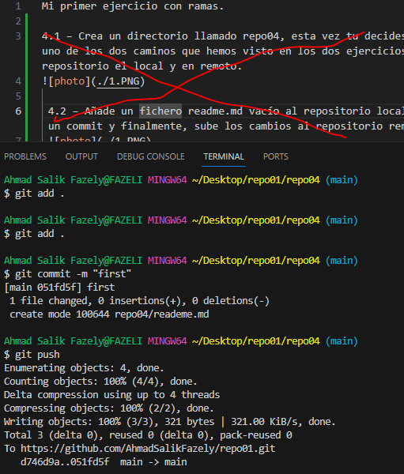
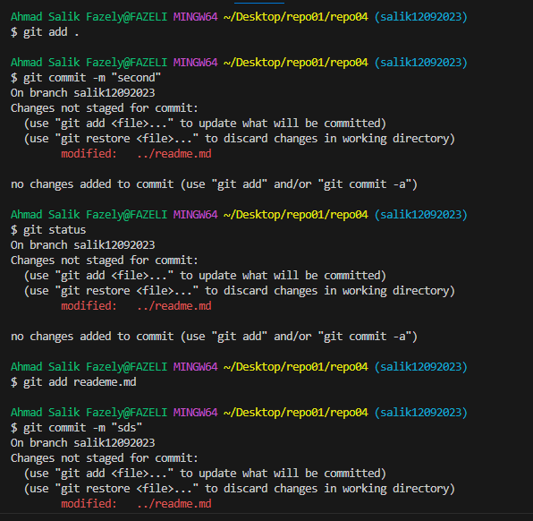
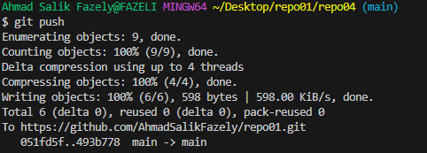

Mi primer ejercicio con ramas.

4.1 – Crea un directorio llamado repo04, esta vez tu decides como lo haces. Es decir, tendrás que seleccionar uno de los dos caminos que hemos visto en los dos ejercicios anteriores. Pero si que queremos que exista el repositorio el local y en remoto.

 4.2 – Añade un fichero readme.md vacío al repositorio local, ejecuta los comandos pertinentes para realizar un commit y finalmente, sube los cambios al repositorio remoto que tendrá el mismo nombre repo04.
 

4.3 – Crea una rama con tu nombre y la fecha actual (por ejemplo en mi caso la rama se llamará david02032022) desde la cual editaremos el fichero

 4.4 – Desde tu rama (david02032022) edita el fichero readme.md de tal forma que quede de la siguiente manera:

4.5 – Haz 3 commits desde nuestra rama (david02032022)

4.6 – En el siguiente orden realiza lo siguiente:
4.6.1 – Fusiona tu rama con master

4.6.2 – Haz un push hacía la nube

4.7 – Elimina solamente la rama en local david02032022 ya que si eliminásemos la remota no veríamos la rama en remoto.

4.8 - Visualiza el resultado tanto mediante el comando git log --all --oneline -decorate –graph, como desde el pluging de VSC

